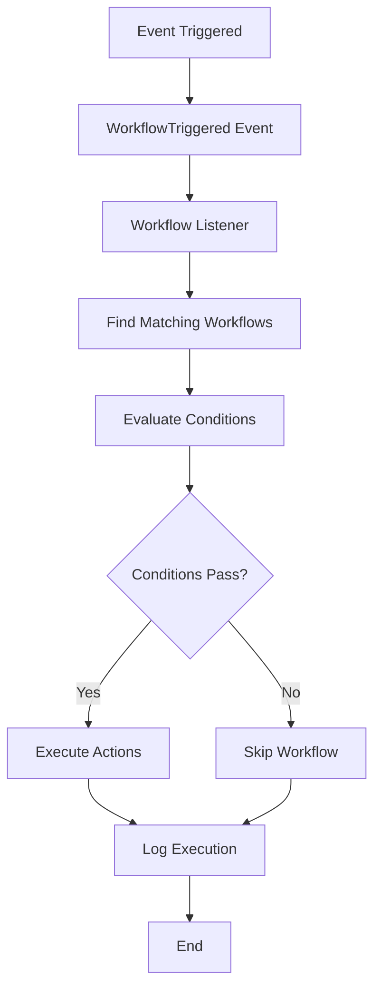

# Save Workbench Workflow Engine Documentation

## Overview

The Save Workbench workflow engine is an event-driven automation system that processes events through a pipeline of condition evaluation and action execution. This document explains the internal architecture and how to extend the system with new components.

## Engine Architecture

### Core Components

```
Event → Listener → Condition Evaluator → Action Executor → Result Logger
```

1. **Event System**: Laravel events that trigger workflow processing
2. **Workflow Matcher**: Finds workflows that match the event type
3. **Condition Evaluator**: Evaluates workflow conditions against event data
4. **Action Executor**: Executes workflow actions when conditions pass
5. **Execution Logger**: Records workflow execution results

### Data Flow



## Event System

### Event Structure

All workflow events extend the `WorkflowTriggered` class:

```php
class WorkflowTriggered
{
    public WorkflowEventType $eventType;    // The type of event
    public Model $sourceModel;              // The model that triggered the event
    public array $eventData;                // Current event data
    public ?array $previousData;            // Previous state for comparisons
}
```

### Available Events

The workflow system currently supports the following events, all triggered from `ProcessGpsDataJob`:

#### Vehicle Location Events

| Event Type | Description | Trigger Condition | Available Data |
|------------|-------------|-------------------|----------------|
| `VEHICLE_LOCATION_UPDATED` | Vehicle's GPS position is updated | Every GPS data point processed | latitude, longitude, speed, ignition, moving, recorded_at |
| `VEHICLE_IGNITION_ON` | Vehicle ignition is turned on | ignition changes from false to true | latitude, longitude, speed, ignition, moving, recorded_at |
| `VEHICLE_IGNITION_OFF` | Vehicle ignition is turned off | ignition changes from true to false | latitude, longitude, speed, ignition, moving, recorded_at |
| `VEHICLE_MOVEMENT_STARTED` | Vehicle starts moving | moving changes from false to true | latitude, longitude, speed, ignition, moving, recorded_at |
| `VEHICLE_MOVEMENT_STOPPED` | Vehicle stops moving | moving changes from true to false | latitude, longitude, speed, ignition, moving, recorded_at |
| `VEHICLE_SPEED_EXCEEDED` | Vehicle exceeds speed limit | speed > configured limit (default 90 km/h) | current_speed, speed_limit, exceeded_by |

#### Geofence Events

| Event Type | Description | Trigger Condition | Available Data |
|------------|-------------|-------------------|----------------|
| `VEHICLE_ENTERED_GEOFENCE` | Vehicle enters a defined geofence | Point-in-polygon check determines vehicle entered a geofence | geofence_id, geofence_name, geofence_type, entry_time, latitude, longitude, speed, ignition, moving, recorded_at |
| `VEHICLE_EXITED_GEOFENCE` | Vehicle exits a defined geofence | Point-in-polygon check determines vehicle left a geofence | geofence_id, geofence_name, geofence_type, exit_time, duration_inside, latitude, longitude, speed, ignition, moving, recorded_at |

### Event Processing Pipeline

1. **Event Dispatch**: Business logic dispatches `WorkflowTriggered` events
2. **Listener Registration**: Events are caught by `WorkflowEventListener`
3. **Workflow Matching**: System finds workflows for the event type and tenant
4. **Execution**: Each matching workflow is processed independently

### Geofence Processing Details

The geofence system provides robust support for various geofence types:

#### Supported Geofence Types

- **Polygon**: Standard GeoJSON polygons with support for holes (exclusion zones)
- **MultiPolygon**: Collections of multiple polygons
- **Point**: Circular geofences around a point (100m radius by default)
- **Circle**: Custom circular geofences with configurable radius

#### Geofence Checking Algorithm

1. **Cache Active Geofences**: Geofences for the vehicle's tenant are cached for 5 minutes
2. **Point-in-Polygon Check**: Uses ray casting algorithm for polygon containment
3. **State Comparison**: Compares current vs previous location geofence membership
4. **Event Triggering**: Dispatches entry/exit events based on membership changes
5. **Duration Tracking**: Caches entry data to calculate time spent in geofences

#### Performance Optimizations

- **Tenant Scoping**: Only checks geofences belonging to the vehicle's tenant
- **Active Filter**: Only processes active geofences
- **Caching**: Geofence data is cached to reduce database queries
- **Early Exit**: Skips processing if no geofences exist for the tenant

### Adding New Event Types

#### 1. Define the Event Type

Add to `app/Enum/WorkflowEventType.php`:

```php
enum WorkflowEventType: string
{
    case NEW_EVENT_TYPE = 'new_event_type';
    
    public function label(): string
    {
        return match ($this) {
            self::NEW_EVENT_TYPE => __('workflows.events.new_event_type'),
            // ... existing cases
        };
    }
    
    public function sourceModel(): string
    {
        return match ($this) {
            self::NEW_EVENT_TYPE => 'YourModel',
            // ... existing cases
        };
    }
}
```

#### 2. Add Translation Keys

Update `lang/en/workflows.php` and `lang/fr/workflows.php`:

```php
'events' => [
    'new_event_type' => 'New Event Type',
    // ... existing events
],
```

#### 3. Create Helper Method

Add to `app/Events/WorkflowTriggered.php`:

```php
public static function newEventType(Model $model, array $data = [], ?array $previousData = null): static
{
    return new static(
        WorkflowEventType::NEW_EVENT_TYPE,
        $model,
        $data,
        $previousData
    );
}
```

#### 4. Trigger from Business Logic

```php
use App\Events\WorkflowTriggered;

// In your business logic
WorkflowTriggered::newEventType($model, $eventData, $previousData)->dispatch();
```

## Condition System

### Condition Evaluation Engine

The `WorkflowConditionEvaluator` processes conditions using this logic:

1. **Group Conditions**: Conditions are grouped by `group_id`
2. **Group Evaluation**: Within each group, conditions are combined with AND/OR logic
3. **Group Combination**: Groups are combined with OR logic
4. **Field Resolution**: Field paths are resolved using dot notation
5. **Operator Application**: Values are compared using the specified operator

### Field Path Resolution

The evaluator supports these path types:

```php
// Model data access
'model.field_name'           // $event->sourceModel->field_name
'model.relationship.field'   // $event->sourceModel->relationship->field

// Event data access  
'event.field_name'          // $event->eventData['field_name']
'event.nested.field'        // $event->eventData['nested']['field']

// Previous data access
'previous.field_name'       // $event->previousData['field_name']

// Direct access (defaults to event data)
'field_name'               // $event->eventData['field_name']
```

### Common Field Paths for Geofence Events

For geofence events, you can access:

```php
// Geofence information
'event.geofence_id'         // ID of the geofence
'event.geofence_name'       // Name of the geofence
'event.geofence_type'       // Type (Polygon, Circle, etc.)

// Entry/Exit specific
'event.entry_time'          // When vehicle entered (entry events)
'event.exit_time'           // When vehicle exited (exit events)
'event.duration_inside'     // Duration in seconds (for exit events)

// Location data
'event.latitude'            // Current latitude
'event.longitude'           // Current longitude
'event.speed'               // Current speed
'event.ignition'            // Ignition status
'event.moving'              // Movement status
```

### Adding New Condition Operators

#### 1. Define the Operator

Add to `app/Enum/WorkflowConditionOperator.php`:

```php
enum WorkflowConditionOperator: string
{
    case NEW_OPERATOR = 'new_operator';
    
    public function label(): string
    {
        return match ($this) {
            self::NEW_OPERATOR => __('workflows.operators.new_operator'),
            // ... existing cases
        };
    }
    
    public function requiresValue(): bool
    {
        return match ($this) {
            self::NEW_OPERATOR => true, // or false if no value needed
            // ... existing cases
        };
    }
    
    public function valueType(): string
    {
        return match ($this) {
            self::NEW_OPERATOR => 'string', // or 'number', 'boolean', etc.
            // ... existing cases
        };
    }
}
```

#### 2. Implement Operator Logic

Add to `WorkflowConditionEvaluator::compareValues()`:

```php
protected function compareValues(mixed $fieldValue, WorkflowConditionOperator $operator, mixed $conditionValue, WorkflowTriggered $event): bool
{
    return match ($operator) {
        WorkflowConditionOperator::NEW_OPERATOR => $this->evaluateNewOperator($fieldValue, $conditionValue, $event),
        // ... existing operators
    };
}

protected function evaluateNewOperator(mixed $fieldValue, mixed $conditionValue, WorkflowTriggered $event): bool
{
    // Implement your operator logic here
    // Return true if condition passes, false otherwise
}
```

#### 3. Add Translations

Update language files with the new operator label.

## Action System

### Action Execution Engine

The `WorkflowActionExecutor` processes actions through:

1. **Parameter Resolution**: Action parameters are resolved and interpolated
2. **Action Dispatch**: The appropriate action method is called
3. **Result Collection**: Action results are collected and standardized
4. **Error Handling**: Failures are caught and logged

### Action Result Format

All actions must return this standardized format:

```php
return [
    'success' => true|false,
    'data' => [...],           // Optional: action-specific data
    'error' => 'string',       // Optional: error message if success = false
];
```

### Variable Interpolation System

The action executor supports variable interpolation in string parameters:

```php
protected function interpolateText(string $text, WorkflowTriggered $event): string
{
    $replacements = [
        '{model.id}' => $event->getModelId(),
        '{model.type}' => $event->getModelType(),
        '{event.type}' => $event->eventType->value,
        '{tenant.id}' => $event->getTenantId() ?? 'central',
        '{timestamp}' => now()->format('Y-m-d H:i:s'),
    ];

    // Add event data replacements
    foreach ($event->eventData as $key => $value) {
        if (is_scalar($value)) {
            $replacements["{event.{$key}}"] = $value;
        }
    }

    // Add model-specific replacements
    if ($event->sourceModel instanceof \App\Models\Vehicle) {
        $vehicle = $event->sourceModel;
        $replacements['{vehicle.name}'] = $vehicle->name ?? 'Unknown';
        $replacements['{vehicle.registration}'] = $vehicle->registration ?? 'Unknown';
    }

    return strtr($text, $replacements);
}
```

### Geofence-Specific Variables

For geofence events, additional variables are available:

```php
// Geofence interpolation variables
'{event.geofence_name}'     // Name of the geofence
'{event.geofence_type}'     // Type of geofence
'{event.entry_time}'        // Entry timestamp (for entry events)
'{event.exit_time}'         // Exit timestamp (for exit events)
'{event.duration_inside}'   // Duration in seconds (for exit events)
```

### Adding New Action Types

#### 1. Define the Action Type

Add to `app/Enum/WorkflowActionType.php`:

```php
enum WorkflowActionType: string
{
    case NEW_ACTION = 'new_action';
    
    public function label(): string
    {
        return match ($this) {
            self::NEW_ACTION => __('workflows.actions.new_action'),
            // ... existing cases
        };
    }
    
    public function applicableModels(): array
    {
        return match ($this) {
            self::NEW_ACTION => ['Vehicle', 'Device'], // or ['*'] for all
            // ... existing cases
        };
    }
    
    public function requiredParameters(): array
    {
        return match ($this) {
            self::NEW_ACTION => ['param1', 'param2'],
            // ... existing cases
        };
    }
}
```

#### 2. Implement Action Logic

Add to `WorkflowActionExecutor::execute()`:

```php
public function execute(WorkflowAction $action, WorkflowTriggered $event, WorkflowExecution $execution): array
{
    try {
        $actionType = WorkflowActionType::from($action->action_type);
        $parameters = $action->parameters;

        return match ($actionType) {
            WorkflowActionType::NEW_ACTION => $this->executeNewAction($parameters, $event),
            // ... existing actions
        };
    } catch (Exception $e) {
        // Error handling
    }
}

protected function executeNewAction(array $parameters, WorkflowTriggered $event): array
{
    // Validate required parameters
    $requiredParams = ['param1', 'param2'];
    foreach ($requiredParams as $param) {
        if (!isset($parameters[$param])) {
            return [
                'success' => false,
                'error' => "Missing required parameter: {$param}"
            ];
        }
    }
    
    // Interpolate parameter values
    $param1 = $this->interpolateText($parameters['param1'], $event);
    $param2 = $parameters['param2']; // Non-string parameters don't need interpolation
    
    try {
        // Implement your action logic here
        $result = $this->performActionLogic($param1, $param2, $event);
        
        return [
            'success' => true,
            'data' => [
                'param1' => $param1,
                'param2' => $param2,
                'result' => $result,
                'executed_at' => now()->toISOString(),
            ],
        ];
        
    } catch (Exception $e) {
        return [
            'success' => false,
            'error' => $e->getMessage(),
        ];
    }
}

protected function performActionLogic($param1, $param2, WorkflowTriggered $event)
{
    // Your specific action implementation
    // This could be:
    // - Sending notifications
    // - Updating database records  
    // - Calling external APIs
    // - Triggering other processes
    
    return 'action_result';
}
```

#### 3. Add Translations and Testing

Update language files and create tests for your new action.

## Workflow Execution Flow

### 1. Event Listener

The `WorkflowEventListener` catches all `WorkflowTriggered` events:

```php
class WorkflowEventListener
{
    public function handle(WorkflowTriggered $event): void
    {
        // Find workflows matching event type and tenant
        $workflows = $this->findMatchingWorkflows($event);
        
        foreach ($workflows as $workflow) {
            $this->executeWorkflow($workflow, $event);
        }
    }
    
    protected function findMatchingWorkflows(WorkflowTriggered $event): Collection
    {
        return Workflow::where('event_type', $event->eventType->value)
            ->where('is_active', true)
            ->where(function ($query) use ($event) {
                $query->where('tenant_id', $event->getTenantId())
                      ->orWhereNull('tenant_id'); // Central workflows
            })
            ->with(['conditions', 'actions'])
            ->get();
    }
}
```

### 2. Condition Evaluation

```php
protected function executeWorkflow(Workflow $workflow, WorkflowTriggered $event): void
{
    // Create execution record
    $execution = WorkflowExecution::create([
        'workflow_id' => $workflow->id,
        'event_type' => $event->eventType->value,
        'event_data' => $event->eventData,
        'status' => 'processing',
    ]);
    
    try {
        // Evaluate conditions
        $conditionsPassed = $this->conditionEvaluator->evaluate($workflow->conditions, $event);
        
        if (!$conditionsPassed) {
            $execution->update([
                'status' => 'skipped',
                'result' => ['reason' => 'Conditions not met']
            ]);
            return;
        }
        
        // Execute actions
        $results = [];
        foreach ($workflow->actions->sortBy('order') as $action) {
            $results[] = $this->actionExecutor->execute($action, $event, $execution);
        }
        
        $execution->update([
            'status' => 'completed',
            'result' => $results
        ]);
        
    } catch (Exception $e) {
        $execution->update([
            'status' => 'failed',
            'result' => ['error' => $e->getMessage()]
        ]);
    }
}
```

## Database Schema

### Core Tables

#### workflows
- `id` - Primary key
- `name` - Workflow name
- `description` - Optional description
- `event_type` - The event that triggers this workflow
- `is_active` - Enable/disable flag
- `tenant_id` - Tenant isolation (nullable for central workflows)
- `created_at`, `updated_at`

#### workflow_conditions
- `id` - Primary key
- `workflow_id` - Foreign key to workflows
- `group_id` - Condition grouping (for OR logic between groups)
- `field_path` - Dot notation path to field
- `operator` - Comparison operator
- `value` - Value to compare against (JSON)
- `logical_operator` - AND/OR for next condition in group
- `order` - Order within group

#### workflow_actions
- `id` - Primary key  
- `workflow_id` - Foreign key to workflows
- `action_type` - Type of action to execute
- `parameters` - Action parameters (JSON)
- `order` - Execution order

#### workflow_executions
- `id` - Primary key
- `workflow_id` - Foreign key to workflows
- `event_type` - Event that triggered execution
- `event_data` - Event data (JSON)
- `status` - processing/completed/failed/skipped
- `result` - Execution results (JSON)
- `created_at`, `updated_at`

## Performance Considerations

### Optimization Strategies

1. **Condition Evaluation**: 
   - Short-circuit evaluation stops at first failing condition in AND groups
   - Minimize complex field path resolution

2. **Database Queries**:
   - Workflows are loaded with conditions and actions in single query
   - Index on `(event_type, is_active, tenant_id)` for workflow matching

3. **Action Execution**:
   - Actions execute synchronously but can dispatch jobs for heavy operations
   - Consider action timeouts for external API calls

4. **Memory Management**:
   - Process workflows individually to prevent memory buildup
   - Log execution results to database rather than keeping in memory

5. **Geofence Processing**:
   - Geofence data is cached for 5 minutes to reduce database load
   - Point-in-polygon calculations are optimized using ray casting algorithm
   - Only active geofences for the vehicle's tenant are processed

## Testing Strategy

### Unit Tests

Test each component in isolation:

```php
class WorkflowConditionEvaluatorTest extends TestCase
{
    public function test_evaluates_basic_operators()
    {
        $evaluator = new WorkflowConditionEvaluator();
        $condition = new WorkflowCondition([
            'field_path' => 'event.speed',
            'operator' => 'greater_than',
            'value' => 90
        ]);
        
        $event = new WorkflowTriggered(
            WorkflowEventType::VEHICLE_LOCATION_UPDATED,
            Vehicle::factory()->make(),
            ['speed' => 95]
        );
        
        $this->assertTrue($evaluator->evaluateCondition($condition, $event));
    }
}
```

### Integration Tests

Test the complete workflow execution:

```php
class WorkflowExecutionTest extends TestCase
{
    public function test_complete_workflow_execution()
    {
        $workflow = Workflow::factory()->create([
            'event_type' => WorkflowEventType::VEHICLE_SPEED_EXCEEDED
        ]);
        
        WorkflowCondition::factory()->create([
            'workflow_id' => $workflow->id,
            'field_path' => 'event.exceeded_by',
            'operator' => 'greater_than',
            'value' => 20
        ]);
        
        WorkflowAction::factory()->create([
            'workflow_id' => $workflow->id,
            'action_type' => WorkflowActionType::LOG_ALERT,
            'parameters' => [
                'message' => 'Test alert',
                'level' => 'warning'
            ]
        ]);
        
        $vehicle = Vehicle::factory()->create();
        
        WorkflowTriggered::vehicleSpeedExceeded($vehicle, 95, 70)->dispatch();
        
        $this->assertDatabaseHas('workflow_executions', [
            'workflow_id' => $workflow->id,
            'status' => 'completed'
        ]);
    }
}
```

### Geofence Testing

Test geofence event triggering:

```php
class GeofenceWorkflowTest extends TestCase
{
    public function test_geofence_entry_triggers_workflow()
    {
        $tenant = Tenant::factory()->create();
        $vehicle = Vehicle::factory()->create(['tenant_id' => $tenant->id]);
        
        // Create a polygon geofence
        $geofence = Geofence::factory()->create([
            'tenant_id' => $tenant->id,
            'geojson' => [
                'type' => 'Polygon',
                'coordinates' => [[[0, 0], [0, 1], [1, 1], [1, 0], [0, 0]]]
            ]
        ]);
        
        // Create workflow for geofence entry
        $workflow = Workflow::factory()->create([
            'event_type' => WorkflowEventType::VEHICLE_ENTERED_GEOFENCE,
            'tenant_id' => $tenant->id
        ]);
        
        // Trigger geofence entry event
        WorkflowTriggered::vehicleEnteredGeofence($vehicle, $geofence, [
            'latitude' => 0.5,
            'longitude' => 0.5
        ])->dispatch();
        
        // Assert workflow executed
        $this->assertDatabaseHas('workflow_executions', [
            'workflow_id' => $workflow->id,
            'event_type' => 'vehicle_entered_geofence'
        ]);
    }
}
```

## Error Handling

### Exception Strategy

1. **Action Failures**: Individual action failures don't stop workflow execution
2. **Condition Errors**: Condition evaluation errors cause workflow to skip
3. **System Errors**: Database or system errors are logged and reported
4. **Timeouts**: Long-running actions should implement timeouts
5. **Geofence Errors**: Invalid geofence geometries are logged but don't stop processing

### Monitoring

- All executions are logged to `workflow_executions` table
- Failed executions include error details in `result` field
- Laravel logs capture detailed error traces
- Geofence processing errors are logged with context
- Consider implementing execution metrics and alerting

## Future Extensions

### Planned Features

1. **Conditional Actions**: Actions that only execute under certain conditions
2. **Action Dependencies**: Actions that wait for other actions to complete  
3. **Scheduled Workflows**: Time-based triggers and recurring executions
4. **Action Rollbacks**: Ability to undo action effects
5. **Workflow Versioning**: Track and manage workflow changes over time
6. **Performance Analytics**: Execution time tracking and optimization recommendations
7. **Advanced Geofencing**: Support for time-based geofences, geofence groups, and hierarchical geofences

### Architecture Considerations

The current design supports these extensions through:
- Modular action system allows complex action types
- Event system can be extended with scheduled events
- Database schema accommodates additional metadata
- Service layer separation enables advanced features
- Geofence system supports multiple geometry types and can be extended

## Conclusion

The Save Workbench workflow engine provides a solid foundation for automating responses to vehicle telemetry events, including comprehensive geofencing capabilities. The current implementation focuses on simplicity and reliability, with the LOG_ALERT action providing comprehensive logging capabilities for monitoring and alerting purposes. 